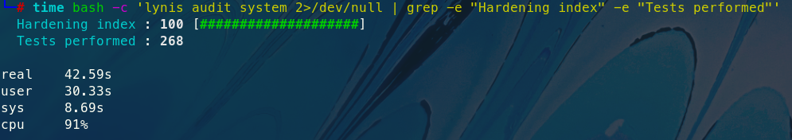

# Lynis hardening index helper

My homework was to make lynis hardening index on kali linux as big as possible.    

  
Lynis does not show:
- how many points are given and when
- how it checks if requirements are fulfilled  

So I made this program to modify lynis and print to stdout:
- how many points are awarded for each check
- file:line location of checks
